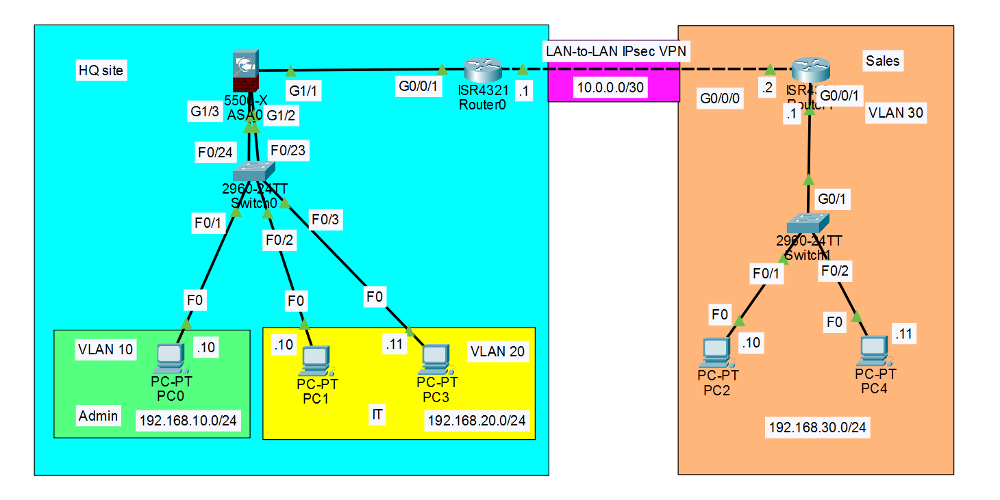
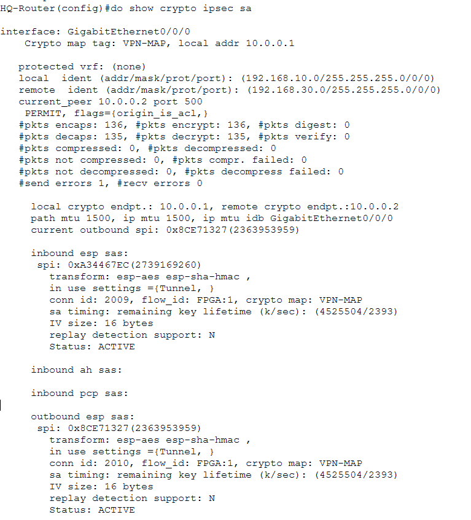
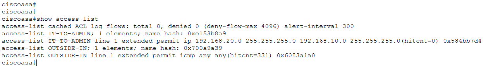
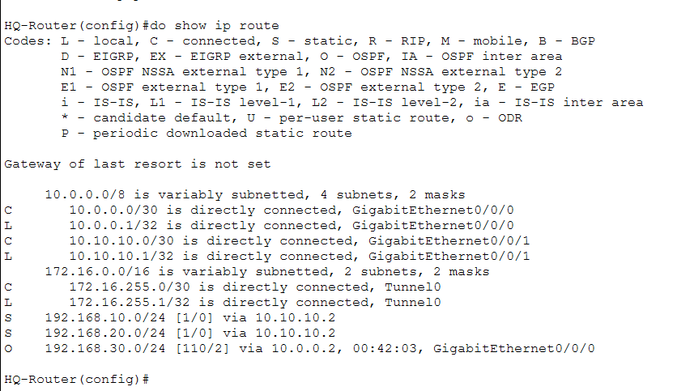
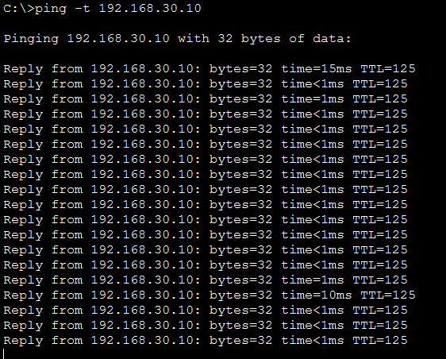

# 🏢 Enterprise Multi-Site Network with UTM & IPsec VPN

## 📖 Executive Summary
This project simulates a highly secure, enterprise-grade corporate network connecting a Headquarters (HQ) and a remote Sales Branch. Building upon a foundational routing and switching architecture, this project was upgraded to deploy a **Unified Threat Management (UTM) Perimeter** and a **Site-to-Site IPsec VPN**.

The primary objective was to demonstrate end-to-end project deployment capabilities, migrating from a legacy Router-on-a-Stick (ROAS) topology to a stateful firewall-based inter-VLAN routing model, while ensuring all WAN traffic is cryptographically secured.

## ⚙️ Core Technologies Implemented
* **Perimeter Security (UTM):** Cisco ASA 5506-X deployment for stateful packet inspection and inter-VLAN routing.
* **Security Zoning:** Granular Access Control Lists (ACLs) managing traffic between Admin (Security Level 100), IT (Security Level 90), and the Outside zone (Security Level 0).
* **Cryptography (VPN):** LAN-to-LAN IPsec VPN using ISAKMP (Phase 1) and ESP-AES / SHA-HMAC (Phase 2) applied via Crypto Maps.
* **Dynamic Routing:** OSPF Area 0 configured across the WAN with Static Route Redistribution for internal firewall networks.
* **L2/L3 Infrastructure:** VLAN segmentation, physical access port segmentation, and edge routing.

## 🗺️ Network Topology
The network consists of two main sites connected via a `10.0.0.0/30` WAN link, overlaid with a secure IPsec tunnel.

*Figure 1: High-level architecture detailing the ASA UTM firewall at HQ and the LAN-to-LAN IPsec VPN overlay.*

## 📊 Updated IP Addressing & Routing Schema

| Device | Interface / Zone | IP Address | Subnet Mask | Purpose |
| :--- | :--- | :--- | :--- | :--- |
| **HQ-Router** | G0/0/0 (WAN) | 10.0.0.1 | 255.255.255.252 | ISP / WAN Link (Crypto Map Applied) |
| | G0/0/1 (Transit) | 10.10.10.1 | 255.255.255.252 | Transit link to ASA Firewall |
| **ASA 5506-X** | G1/1 (Outside - 0) | 10.10.10.2 | 255.255.255.252 | Default gateway to WAN |
| | G1/2 (Admin - 100) | 192.168.10.1 | 255.255.255.0 | Gateway for VLAN 10 |
| | G1/3 (IT - 90) | 192.168.20.1 | 255.255.255.0 | Gateway for VLAN 20 |
| **Sales-Router**| G0/0/0 (WAN) | 10.0.0.2 | 255.255.255.252 | ISP / WAN Link (Crypto Map Applied) |
| | G0/0/1 (LAN) | 192.168.30.1 | 255.255.255.0 | Gateway for VLAN 30 |

---

## 🔐 Proof of Concept & Verification

### 1. Cryptographic Verification (IPsec VPN)
To ensure data confidentiality and integrity across the WAN, a Site-to-Site IPsec VPN was established. The output below confirms active Security Associations (SAs) and real-time encryption/decryption of ICMP traffic traversing the WAN.

*Figure 2: Active IPsec tunnel demonstrating successful packet encapsulation and decapsulation.*

### 2. UTM Firewall & Stateful Inspection
Inter-VLAN routing was offloaded from the edge router to the Cisco ASA. Traffic from the lower-security IT VLAN (90) to the higher-security Admin VLAN (100) is strictly governed by an Extended ACL. 

*Figure 3: Firewall hit counts demonstrating active packet filtering and successful ICMP return traffic via the OUTSIDE-IN rule.*

### 3. Dynamic Route Redistribution (OSPF)
To ensure the Sales branch can locate the networks hidden behind the HQ Firewall, static routes pointing to the ASA were injected and dynamically redistributed into the OSPF process.

*Figure 4: HQ-Router routing table showing connected transit links, static firewall routes, and OSPF adjacencies.*

### 4. End-to-End Encrypted Connectivity
Successful continuous ping across the encrypted tunnel from the HQ Admin VLAN to the remote Sales branch.

---

## 🛠️ Real-World Troubleshooting & Engineering Challenges

During the deployment of this enterprise architecture within the simulator environment, several technical roadblocks were encountered and systematically resolved using standard network engineering principles.

* 🔴 **Issue 1: Firewall 802.1Q Trunking Limitations**
  * **Symptom:** The Cisco ASA 5506-X image rejected the creation of logical subinterfaces (`GigabitEthernet1/2.10`), preventing a standard trunked connection to the core switch.
  * **Resolution:** Engineered a physical segmentation workaround. Deployed discrete physical cables mapping the ASA's interfaces directly to switch ports configured in dedicated Access Mode for specific VLANs.

* 🔴 **Issue 2: Asymmetric Routing and ICMP Drops**
  * **Symptom:** Internal PCs could successfully route packets to the edge router, but the return ping was dropped, resulting in "Destination Host Unreachable" errors.
  * **Resolution:** Identified that the ASA's default behavior drops uninspected returning ICMP traffic on Security Level 0 interfaces. Deployed an `OUTSIDE-IN` Extended ACL explicitly permitting returning ICMP traffic to pass through the perimeter back to the internal stateful connections.

* 🔴 **Issue 3: GRE/IPsec VTI Failures**
  * **Symptom:** Attempts to deploy a modern Virtual Tunnel Interface (VTI) using GRE over IPsec failed due to simulator software limitations and missing crypto-license features on the virtual ISR 4321.
  * **Resolution:** Pivoted the architecture to a legacy, highly stable **LAN-to-LAN IPsec design**. Removed the GRE overlays, restored physical OSPF adjacencies, and deployed **Crypto Maps** matched against proxy ACLs to encrypt interesting traffic directly on the physical interfaces.

---
## 🚀 How to Run This Project
1. **Install Packet Tracer:** Ensure you have Cisco Packet Tracer version 8.2 or higher installed.
2. **Download:** Clone this repository or download the `.pkt` file.
3. **Open:** Launch Packet Tracer and open the project file.
4. **Test Encryption:** Open the Command Prompt on `PC0` and execute `ping -t 192.168.30.10`. While running, log into `HQ-Router`, enter privileged exec mode, and run `show crypto ipsec sa` to watch the encryption counters increment in real-time.
